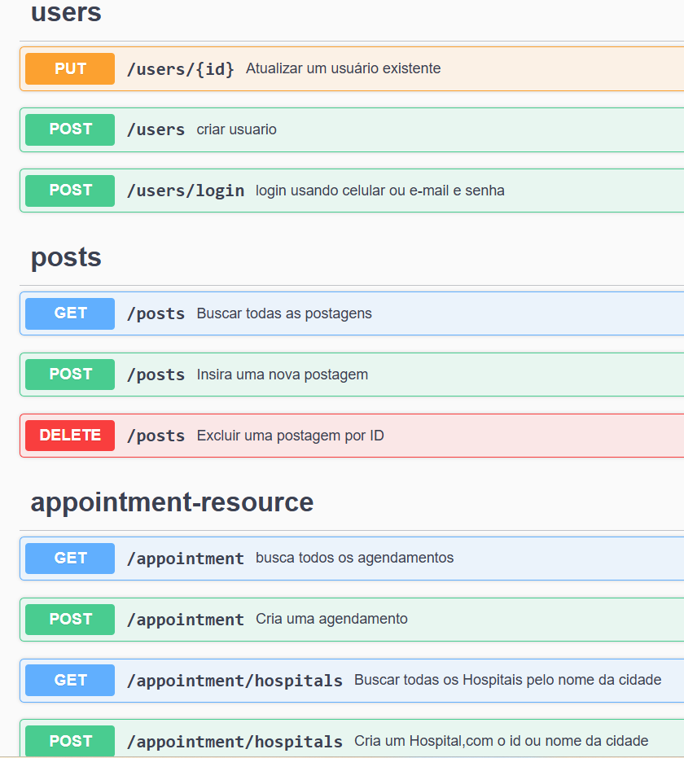
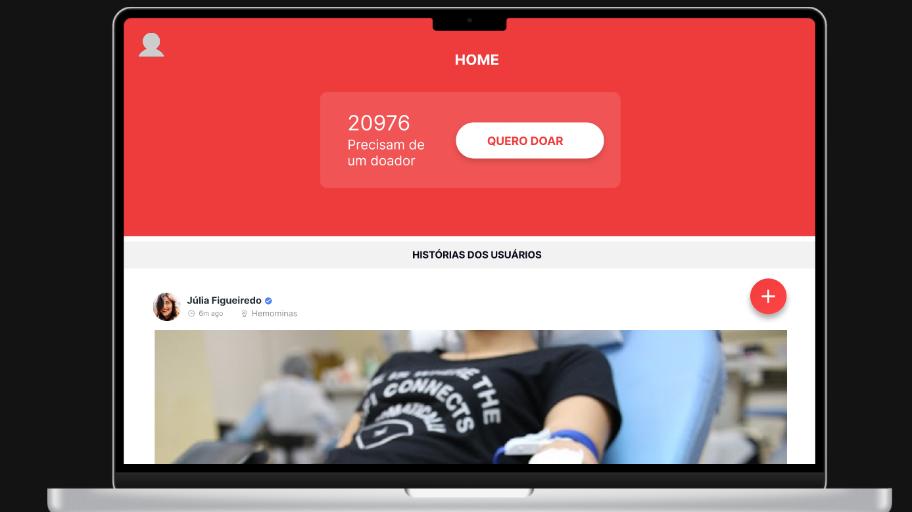

# Doe Mais Vida

Projeto de para agendamento e facilitação de doação de sangue.

## Descrição

O projeto *Doe Mais Vida* é uma aplicação de uma api Spring Boot que visa facilitar a doação de sangue. Ele inclui funcionalidades de gerenciamento de doadores, registro de doações, um feed de postagem caso queira insetivar outras pessoas a doarem sangue e uma interface web para interação.

## Tecnologias Utilizadas

- *Java 17*
- *Spring Boot 3.2.5*
    - Spring Boot Starter Data JPA
    - Spring Boot Starter Validation
    - Spring Boot Starter Web
    - Spring Boot Starter Test
- *Banco de Dados H2* (para runtime)
- *Banco de Dados MySQL*
- *Lombok* (opcional)
- *Spring Security Core 6.3.0*
- *Swagger/OpenAPI* (versão 2.2.0) para documentação da API

## Pré-requisitos

- Java 17 ou superior
- Maven 3.6.3 ou superior
- spring boot 3.2.5 ou superior

## Como executar

1. Clone o repositório:
   ```sh
   git clone https://github.com/Leonardogabriels/Doe-Mais-Vida.git
   cd doemaisvida
   mvn spring-boot:run


### Estrutura do Projeto:

- src/main/java: Contém o código-fonte da aplicação.
- src/main/resources: Contém os recursos da aplicação, como arquivos de configuração.

## Configuração


A aplicação utiliza diferentes arquivos application.properties para diferentes ambientes (perfil de desenvolvimento e de teste):
### como:
 -  **application.properties:** para diferentes ambientes (perfil de desenvolvimento e de teste): **por ele você alterna entre os demais perfis**
- **application-test.properties:** Este arquivo contém configurações específicas para o ambiente de teste, utilizando o banco de dados H2:
- **application-dev.properties:**  Este arquivo contém configurações específicas para o ambiente de desenvolvimento, utilizando o banco de dados MySQL: **lembre-se de trocar usuario e senha no arquivo para conseguir ultilizar**
## Endpoints da API :

- A documentação completa dos endpoints da API está disponível no Swagger UI. Após iniciar a aplicação, acesse:

bash
Copiar código
http://localhost:8080/swagger-ui.html

## Front-end da aplicação:

Caso pretenda fazer a implementação completa a baixo está o link do front-end desenvolvido por outros profissionais 

- **Link Github:** https://github.com/ivanPechim/doe-mais-vida

## Protótipos da aplicação:



- Visualize todos os protótipos aqui: https://www.figma.com/design/KLZ5mVqHnjWLOkrsGCNd7v/DOE%2BVIDA?node-id=0-1
### Contribuição
Contribuições são bem-vindas! Sinta-se à vontade para abrir uma issue ou enviar um pull request.

## Licença
Este projeto está licenciado sob a MIT License - veja o arquivo LICENSE para detalhes.

